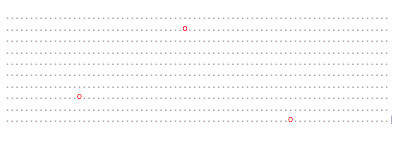

# Defender

link to launch the web app: <a href="http://binghuan.github.io/rockdefender/" target="_blank">http://binghuan.github.io/rockdefender/</a>

## Defender

Nasty Aliens are hurling red rocks at the planet Earth. Our last line of defence- The Paddle. Write the AI for The Paddle to defend the Earth from certain destruction.

Download the instructions manual: <a href="defender-test.pdf">defender-test.pdf</a>

This is not specifically a "front-end" test

This test requires only writing the logic for the movement of the paddle and not the UI.

You must write a solution to this test using Javascript, but note that you do not need to interact with the "document object model" (DOM), and sothis test is not specifically a "front-end" test. Even if you have limited understanding of Javascript, you should be able to tackle this test.For those of you new to Javascript, I would suggest review the math and array functions available in Javascript:
http://www.w3schools.com/jsref/jsref_obj_math.asp
http://www.w3schools.com/js/js_arrays.asp

 
Coding quest from "BaseCase"
